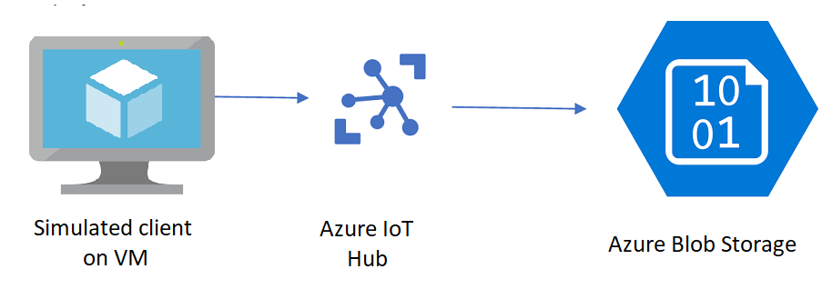
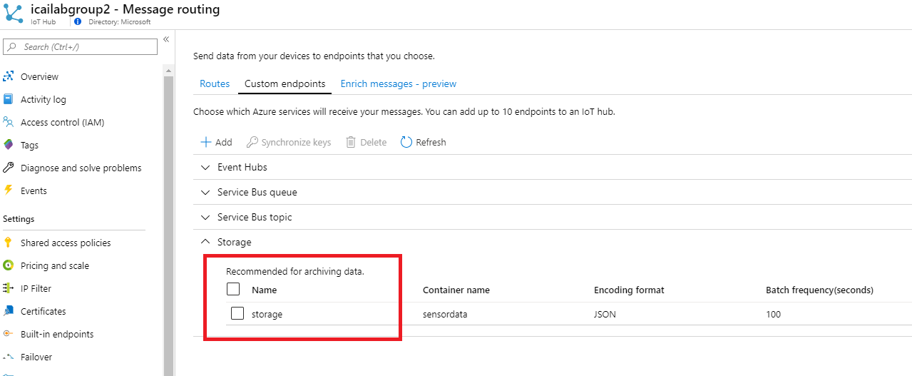
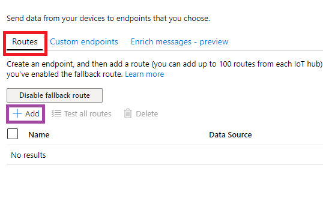
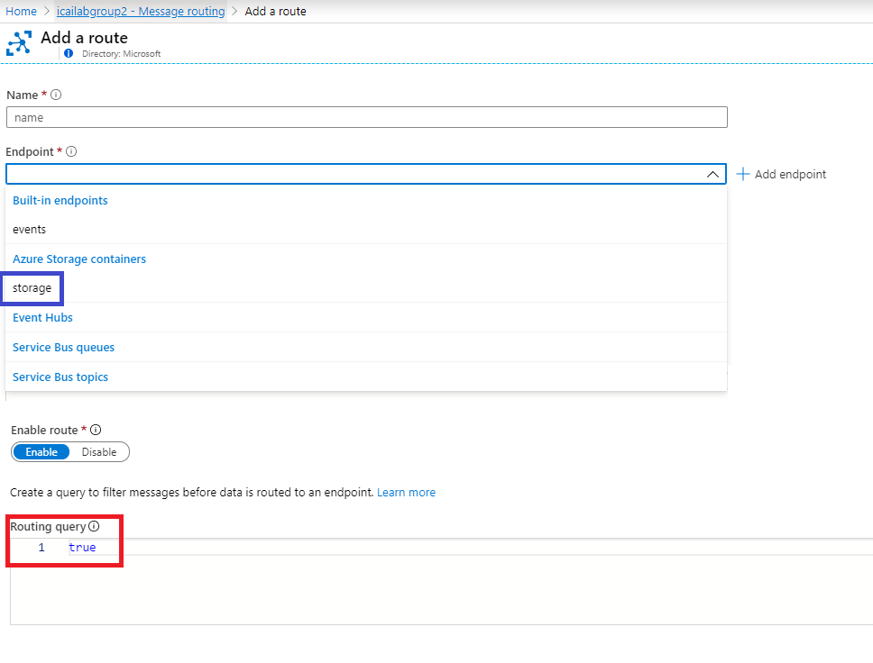
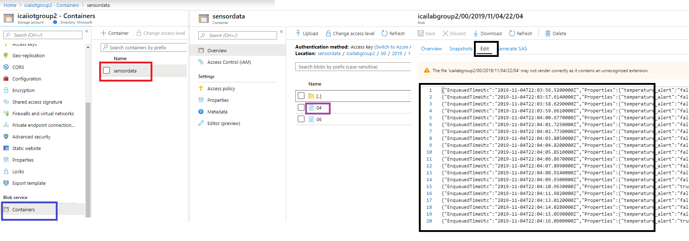

# Routing messages from Azure IoT Hub to an storage account
Azure IoT hub is intended to route messages, based on different conditions to different destionations. This capability is called message brokering. The following image shows this concept.

In this lab, we will store data in the previously created storage account, which is intended for storing massive ammount of data from millions of devices.
The outcome of this module is competing the end to end architecture presented.

## Creating a Custom Endpoint of type Storage under Azure IoT Hub routes

First we need to declare the previously created storage endpoint. Select **Message routing** (red), **Custom endpoints** (blue). Click **Add** (green) and select **Storage**, as shown in the diagram below.

Name the endpoint **storage** (internal name) as shown in red. Select **Encoding** in JSON for better human readability. Then click **Pick a Container** (Storage Container) created in the previous module, as shown below in blue.

In the menu displayed, click **Storage account** then add a container **+ Container** and **Select** the previously created container, as shown below:

Once the container has been properly selected,  the container URL will be shown in the following window, as highlighted in blue. Click **Create** to proceed.

Once the task is completed, the **Custom endpoint** will be shown as highlighted in red in the image below:

## Creating a Custom Endpoint of type Storage under Azure IoT Hub routes

In the previous step, we declared an Azure Storage container as a potential destination for sending device messages. In this step, we are going to configure all messages to be sent to that endpoint.
In the previous blade, select the **Routes** submenu, highlighted in red and click **+Add** for creating a route, as shown below:

The image below will display. Input a name, for example, **Route**, in the **Endpoint** dropdown, select the previously created endpoint, named **storage**. Select the default option **DeviceMessages**

Note in this case all messages will go to this endpoint, since the **Routing query** is set to **True**. A very powerful query language can be input in order to route messages based on various numerous fields. Please visit the Azure IoT Hub Query Syntax [documentation](https://docs.microsoft.com/en-us/azure/iot-hub/iot-hub-devguide-routing-query-syntax) for further details.

Once the route is active, the following information will be shown in the screen.

## Sending messages to Azure IoT hub from the simulated device.

Review module 2 in which we sent traffic to Azure IoT Hub from the simulated device.

`vmuser@simulated-device:~$ python azure-iot/iot-client/iot-hub-client.py `**`"HostName=icaiiotlabgroup1.azure-devices.net;DeviceId=simulatedDevice;SharedAccessKey=7VA3mGEaP8U8JiH899kFGJitTrGA3YuXsj8QcxGDnic="`**

Messages will not show up in the Storage instantaneously, as a default **Batch frequency** of 100 seconds, was configured while creating the Storage endpoint

## Sending messages to Azure IoT hub from the simulated device.

After waiting for the period in the batch frequency field, device data will be stored in the storage account. Navigate to the storage account and see the messages stored in text, as shown in the next window path.

